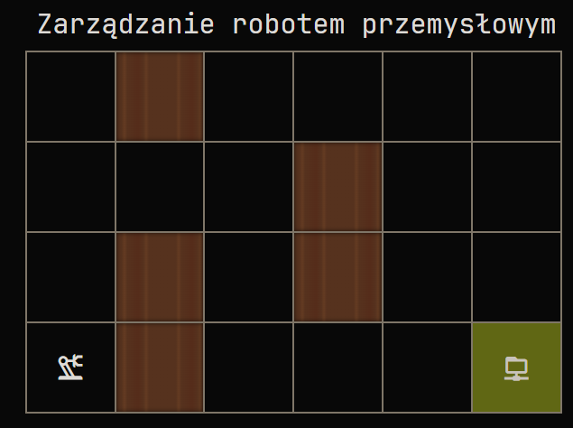

## Zadanie

### Instrukcja dla operatora robota

Robot może poruszać się w kierunkach: góra, dół, lewa, prawa

Robot rozumie tylko program, który generuje dla niego poniższą strukturę.

{
"steps": "UP, RIGHT, DOWN, LEFT"
}
Jeśli Twoja aplikacja potrzebuje przestrzeni na przemyślenia, możesz oznaczyć fragment kodu, który ma być wykonany za pomocą taga <RESULT>

tutaj rozumowanie robota
kolejna linia rozumowania
<RESULT>
{
"steps": "UP, RIGHT, DOWN, LEFT"
}
</RESULT>

Jeśli JSON zawiera więcej pól niż tylko "steps", to są one ignorowane i nie wpływają na wykonanie programu
Każdy robot trafia w ręce użytkownika z czystą pamięcią, bez wgranych do niej map pomieszczenia. Przed pierwszym użyciem należy zaznajomić robota z topografią magazynu.
Kontakt ze ścianą na skutek nieumiejętnego sterowania może doprowadzić do uszkodzenia robota, a tym samym do utraty gwarancji na urządzenie
Ze względów ekonomicznych, mózg robota zasilany jest modelem GPT-4o-mini, co w zupełności wystarcza do obsługi przestrzeni magazynowej
Używanie robota w celach innych niż przenoszenie towarów w magazynie jest zabronione. Wszelkie zabawy w stylu wykonywania robotem konami codes będą surowo karane.

## Prompt(Odpowiedź)

You are tasked with navigating a 2D grid as a robot, starting from a specific position, and using provided movement instructions in JSON format to reach a designated reward location. Here’s a detailed guide and conditions for your task:

### Grid Layout

- The grid represents a room composed of various squares, each identified by a coordinate pair [Row, Column].
- **Legend:**
  - **p**: Open space where you can move.
  - **s**: Wall that you cannot enter.
  - **pr**: Your current starting position.
  - **n**: Reward location that you aim to reach.

### Current Grid Representation:

```
[0, 0] = p    [0, 1] = s    [0, 2] = p    [0, 3] = p    [0, 4] = p    [0, 5] = p
[1, 0] = p    [1, 1] = p    [1, 2] = p    [1, 3] = s    [1, 4] = p    [1, 5] = p
[2, 0] = p    [2, 1] = s    [2, 2] = p    [2, 3] = s    [2, 4] = p    [2, 5] = p
[3, 0] = y   [3, 1] = s    [3, 2] = p    [3, 3] = p    [3, 4] = p    [3, 5] = n
```

### Task:

- Follow movement instructions given in a JSON format.
- Movement directions can be: **UP, RIGHT, DOWN,** and **LEFT**.
- Your starting position is at [3,0] marked as **y**.
- Your goal is to navigate to [3,5] marked as **n**.

### Movement Constraints:

- You can only move to adjacent squares: one step at a time.
- You must avoid all walls denoted by **s**.
- Stay within the bounds of the grid.

### Objective:

1. Calculate the path from your starting position to the reward, ensuring no collisions with walls.
2. Define the movement path clearly.
3. Verify that each move is valid and does not lead into walls.
4. Output the movement steps in JSON format within `<RESULT></RESULT>` tags.

### Example Output:

```xml
<RESULT>{"steps": "RIGHT, RIGHT, RIGHT, RIGHT, RIGHT"}</RESULT>
```
