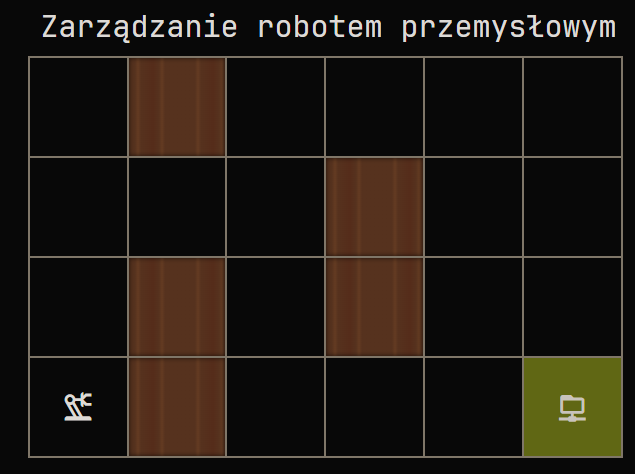

## Zadanie

### Instrukcja dla operatora robota

Robot może poruszać się w kierunkach: góra, dół, lewa, prawa

Robot rozumie tylko program, który generuje dla niego poniższą strukturę.

{
"steps": "UP, RIGHT, DOWN, LEFT"
}
Jeśli Twoja aplikacja potrzebuje przestrzeni na przemyślenia, możesz oznaczyć fragment kodu, który ma być wykonany za pomocą taga <RESULT>

tutaj rozumowanie robota
kolejna linia rozumowania
<RESULT>
{
"steps": "UP, RIGHT, DOWN, LEFT"
}
</RESULT>

Jeśli JSON zawiera więcej pól niż tylko "steps", to są one ignorowane i nie wpływają na wykonanie programu
Każdy robot trafia w ręce użytkownika z czystą pamięcią, bez wgranych do niej map pomieszczenia. Przed pierwszym użyciem należy zaznajomić robota z topografią magazynu.
Kontakt ze ścianą na skutek nieumiejętnego sterowania może doprowadzić do uszkodzenia robota, a tym samym do utraty gwarancji na urządzenie
Ze względów ekonomicznych, mózg robota zasilany jest modelem GPT-4o-mini, co w zupełności wystarcza do obsługi przestrzeni magazynowej
Używanie robota w celach innych niż przenoszenie towarów w magazynie jest zabronione. Wszelkie zabawy w stylu wykonywania robotem konami codes będą surowo karane.

## Prompt(Odpowiedź)

Jesteś robotem, który może się poruszać za pomocą instrukcji.
Instrukcje są w postaci json, który przyjmuje klucz steps oraz wartości: UP, RIGHT. DOWN i LEFT w stringu oddzielone przecinkami.

Pomieszczenie w którym się znajdujesz jest w 2d w postaci siatki o rozmiarach (Wiersz, Kolumna):
(0,0) = p
(0,1) = s
(0,2) = p
(0,3) = p
(0,4) = p
(0,5) = p

(1,0) = p
(1,1) = p
(1,2) = p
(1,3) = s
(1,4) = p
(1,5) = p

(2,0) = p
(2,1) = s
(2,2) = p
(2,3) = s
(2,4) = p
(2,5) = p

(3,0) = pr
(3,1) = s
(3,2) = p
(3,3) = p
(3,4) = p
(3,5) = n

p - przestrzeń po której możesz się poruszać.
s - ściana, na którą nie możesz wejść.
pr - Twoja aktualna pozycja startowa. Po opuszczeniu stanie się p.
n - nagroda.

Możesz się poruszać tylko o jedno pole. Zabrania się wchodzenia w ściany oraz niewspomniane pola.
Wyznacz drogę do nagrody unikając ścian. Opisz proponowane sekwencje ruchów i sprawdź, czy na pewno nie wszedłeś w ścianę. Na koniec odpowiedz jsonem w tagach <RESULT>odpowiedź</RESULT>
